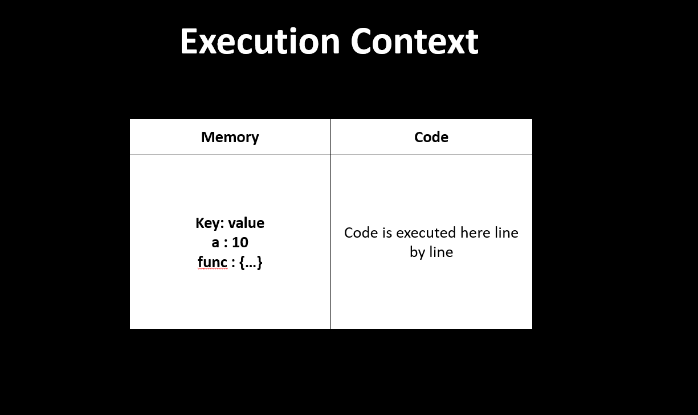
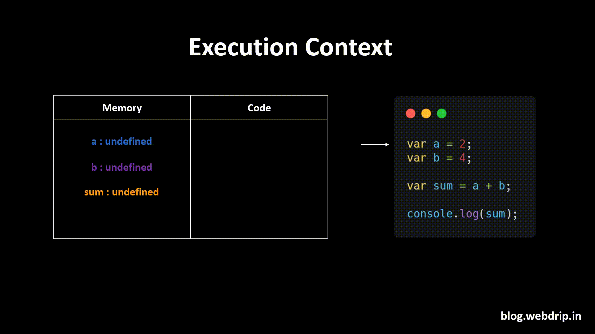
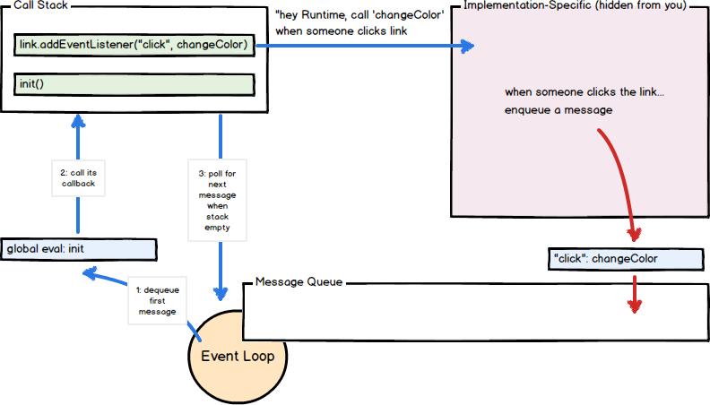

## Introduction

1. JavaScript (JS) is a interpreted, or just-in-time compiled programming language with first-class functions.
2. JavaScript is a multi-paradigm, single-threaded, dynamic language, supporting object-oriented, functional programming styles.
3. JavaScript well-known as the scripting language for Web pages, now used in almost everywhere. 

## Execution context

1. “Everything in JavaScript happens inside an Execution Context”
    1. Memory component 
    2. Code component



```JS
var a = 2;
var b = 4;

var sum = a + b;
console.log(sum);
```



## Asynchronus execution




Refereces:
1. https://javascript.plainenglish.io/how-javascript-works-a-visual-guide-515199eef837
2. https://developer.mozilla.org/en-US/docs/Web/JavaScript
3. http://latentflip.com/loupe/?code=Y29uc29sZS5sb2coIkhpISIpOwoKc2V0VGltZW91dChmdW5jdGlvbiB0aW1lb3V0KCkgewogICAgY29uc29sZS5sb2coIkNsaWNrIHRoZSBidXR0b24hIik7Cn0sIDUwMDApOwoKY29uc29sZS5sb2coIldlbGNvbWUgdG8gbG91cGUuIik7!!!PGJ1dHRvbj5DbGljayBtZSE8L2J1dHRvbj4%3D